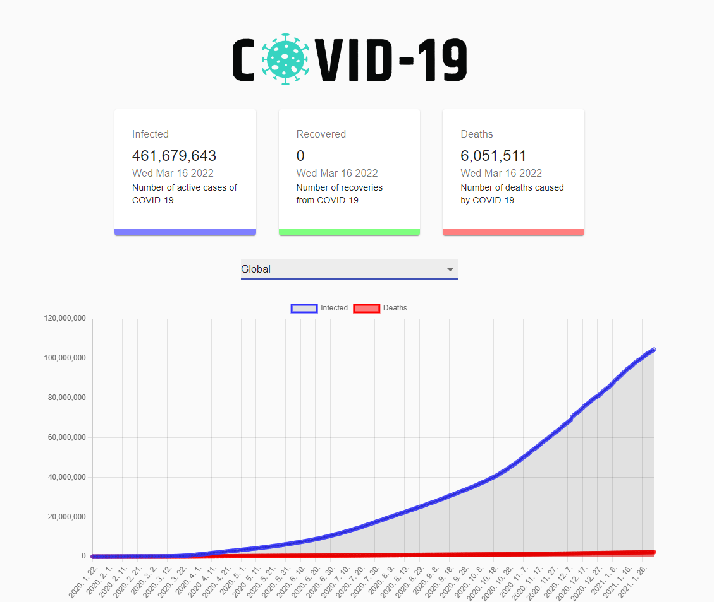

# < 😷 COVID-19 Tracker >

전세계 코로나 바이러스 감염 현황 API를 이용하여 데이터를 시각화 한 `반응형 웹페이지`를 구현하였다. 전세계인의 감염자수와 사망자수 데이터는 꺽은선 그래프로 시각화하였고, 180여개의 국가 중 특정 국가를 선택하여 감염자수와 사망자 수 데이터를 막대 차트로 시각화하였다.

 

 

> ### 사용툴

- VScode
- React
- Material UI

 

> ### 사용 API

<a href="https://covid19.mathdro.id/api">전세계 코로나감염현황 API</a>

 

> ### 사용 UI

<a href="https://mui.com/getting-started/installation/"> Materia UI</a>

 

> ### 다운로드 패키지

 

| 패키지            | 기능                      |
| ----------------- | :------------------------ |
| axios             | API 요청 수행             |
| react-chartjs-2   | 차트 만들기               |
| chart.js          | 차트 만들기               |
| react-countup     | 수치 증가 애니메이션 표현 |
| classnames        | CSS ClassName 여러개 지정 |
| @material-ui/core | UI 툴 제공                |

 

> ### 기능

 

- COVID-19 API 데이터를 패칭하고 비동기식으로 데이터 처리
- 모바일 & 태블릿에서도 화면이 깨지지 않도록 반응형 웹페이지 구현
- 180여개 국가의 코로나 감염 현황 데이터 시각화

 

> ### 한계점

 

- 현재 API에서 회복한 사람 수의 데이터가 제공되지 않고 있다. 그리하여 recovered 수가 '0'으로 설정되어 있다.
- 일일데이터는 제공되지 않아 현재 최종 통계 데이터만 가져올 수 있다.
